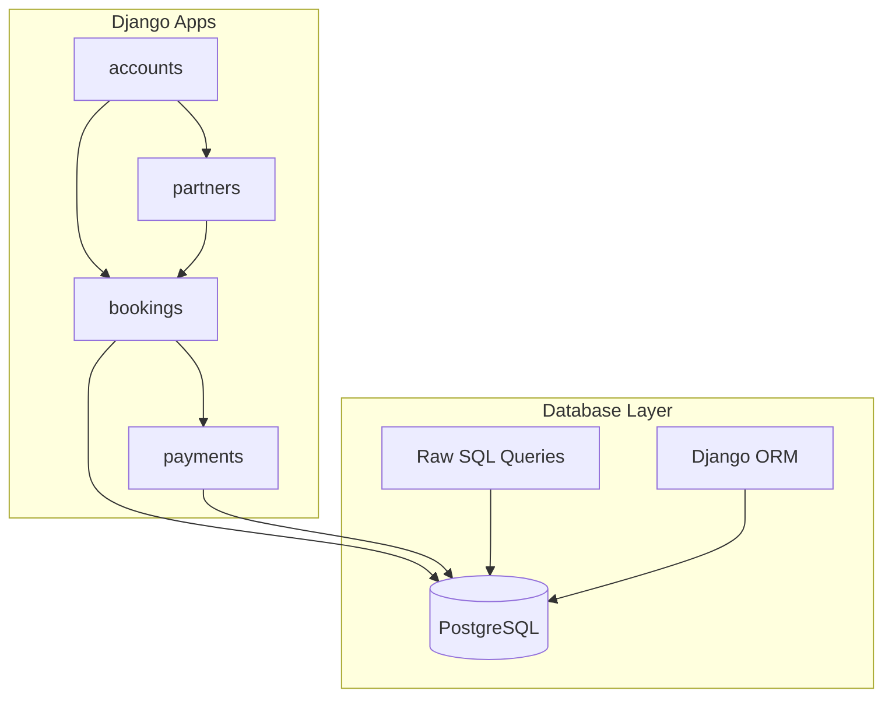
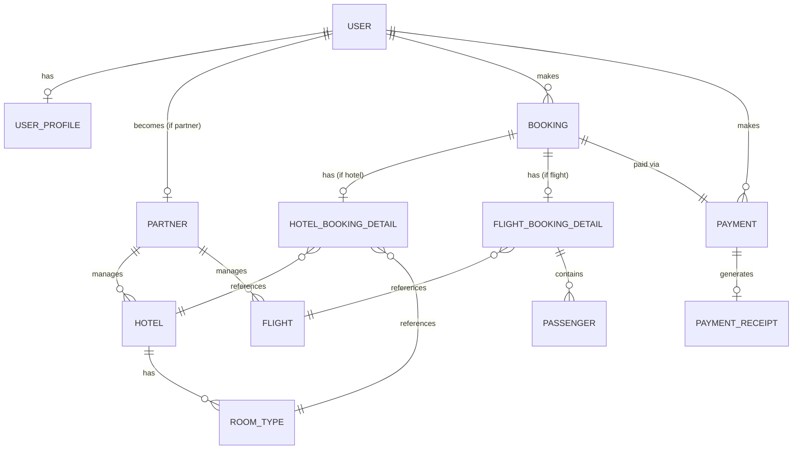
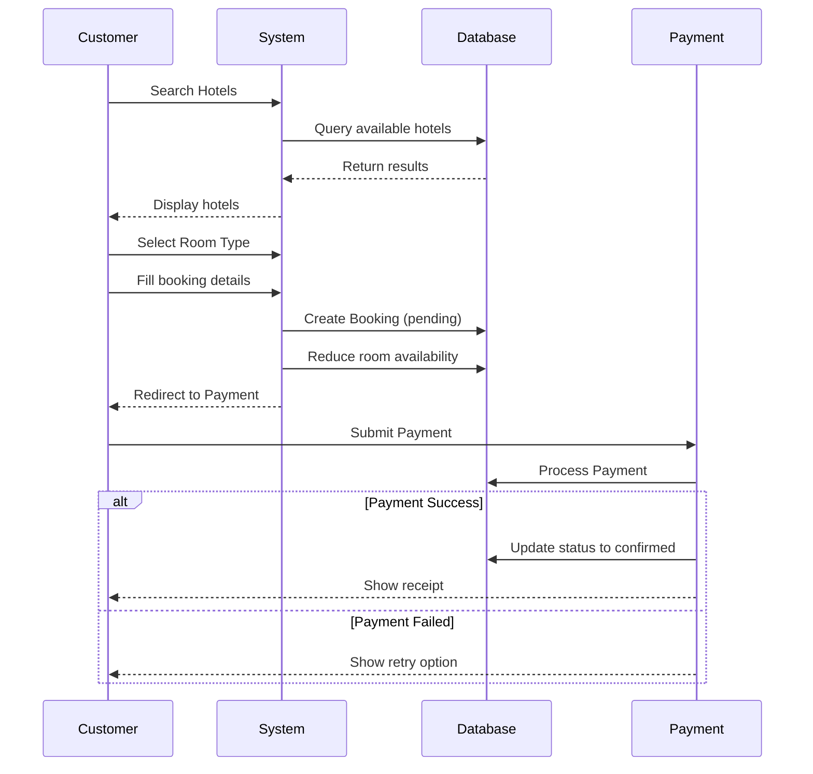
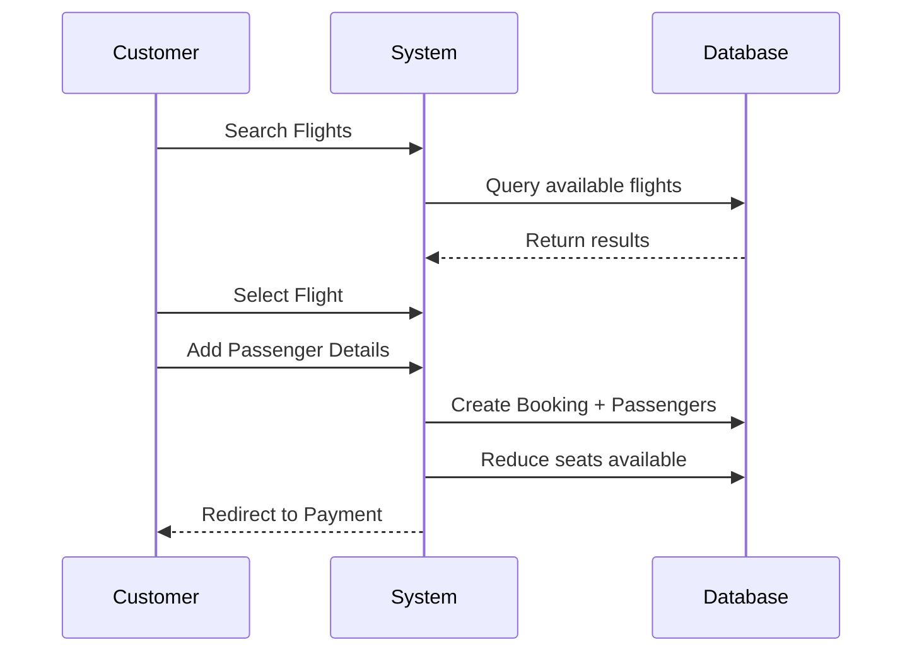

# Travel Booking System - Project Workflow Documentation

This document provides a comprehensive overview of your CSX3006 Database System project.

---

## 🏗️ Project Architecture



---

## 📦 App Structure

| App | Purpose |
|-----|---------|
| **accounts** | User authentication, roles (Customer, Partner, Admin), profiles |
| **partners** | Hotel & Flight management by partner companies |
| **bookings** | Booking creation for hotels and flights |
| **payments** | Payment processing, receipts, refunds |
| **utils** | Raw SQL database manager |

---

## 🗄️ Database Schema (ER Diagram Overview)



---

## 👥 User Roles

| Role | Description | Permissions |
|------|-------------|-------------|
| **Customer** | End users who book hotels/flights | Search, Book, Pay, View bookings |
| **Partner** | Business owners (hotels/airlines) | Manage hotels, flights, view bookings |
| **Admin** | System administrators | Full access via Django Admin |

---

## 🔄 Booking Workflow

### Hotel Booking Flow


### Flight Booking Flow


---

## 📊 Key Models Summary

### accounts App
- **User**: Custom user with roles (customer/partner/admin)
- **UserProfile**: Extended user info (bio, address, etc.)

### partners App
- **Partner**: Business entity linked to partner user
- **Hotel**: Hotel properties with star rating, amenities
- **RoomType**: Room categories with pricing
- **Flight**: Flight schedules with pricing

### bookings App
- **Booking**: Main booking record (hotel or flight)
- **HotelBookingDetail**: Check-in/out dates, rooms, guests
- **FlightBookingDetail**: Passengers, price per seat
- **Passenger**: Individual passenger info for flights

### payments App
- **Payment**: Payment records with multiple methods
- **PaymentReceipt**: Generated receipts

---

## 🔧 Raw SQL Layer

Located in `utils/db_manager.py`:

| Class | Purpose |
|-------|---------|
| `DatabaseManager` | Execute raw SQL queries |
| `BookingQueries` | User bookings, hotel details, availability |
| `HotelQueries` | Hotel search, statistics |
| `ReportQueries` | Revenue reports, analytics |

### Example Raw SQL Query
```sql
SELECT b.booking_id, b.status, b.total_amount, u.username
FROM bookings_booking b
INNER JOIN accounts_user u ON b.user_id = u.id
WHERE u.id = %s
ORDER BY b.created_at DESC;
```

---

## 🌐 URL Structure

| URL Pattern | View | Purpose |
|-------------|------|---------|
| `/` | home | Landing page |
| `/accounts/login/` | login | User login |
| `/accounts/register/` | register | User registration |
| `/accounts/dashboard/` | dashboard | User dashboard |
| `/bookings/hotels/` | hotel_search | Search hotels |
| `/bookings/hotels/<id>/` | hotel_detail | Hotel details |
| `/bookings/flights/` | flight_search | Search flights |
| `/bookings/my-bookings/` | my_bookings | User's bookings |
| `/payments/<booking_id>/` | payment_page | Process payment |
| `/admin/` | Django Admin | Admin interface |

---

## 🚀 How to Run

```bash
# 1. Activate virtual environment
source venv/bin/activate

# 2. Start PostgreSQL (make sure it's running)

# 3. Run migrations
python manage.py migrate

# 4. Create superuser (if needed)
python manage.py createsuperuser

# 5. Start server
python manage.py runserver
```

---

## 📝 For Your Presentation

### Key Points to Highlight:
1. **Three-tier architecture**: Presentation (Templates) → Business Logic (Views) → Data (Models/PostgreSQL)
2. **Both ORM and Raw SQL**: Demonstrates understanding of both approaches
3. **Role-based access**: Customer, Partner, Admin with different permissions
4. **Relational database design**: Proper use of foreign keys, one-to-one, many-to-many relationships
5. **Transaction management**: Atomic operations for bookings

### Database Features Used:
- ✅ PostgreSQL database
- ✅ Foreign Key relationships
- ✅ Indexes for performance
- ✅ UUID for unique identifiers
- ✅ Raw SQL queries in `db_manager.py`
- ✅ Aggregate functions (SUM, COUNT, AVG)
- ✅ JOINs (INNER, LEFT)
- ✅ Subqueries
